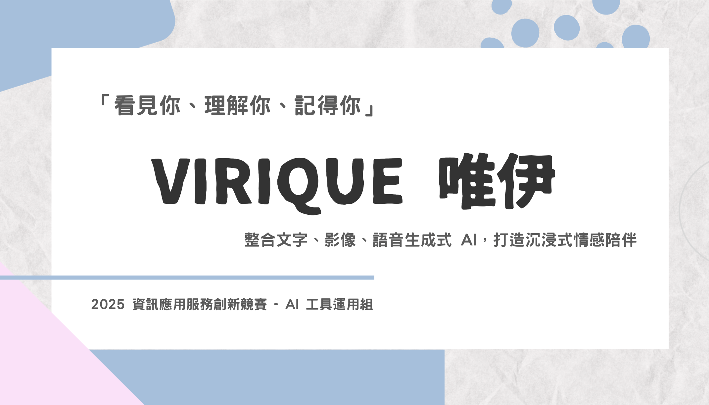
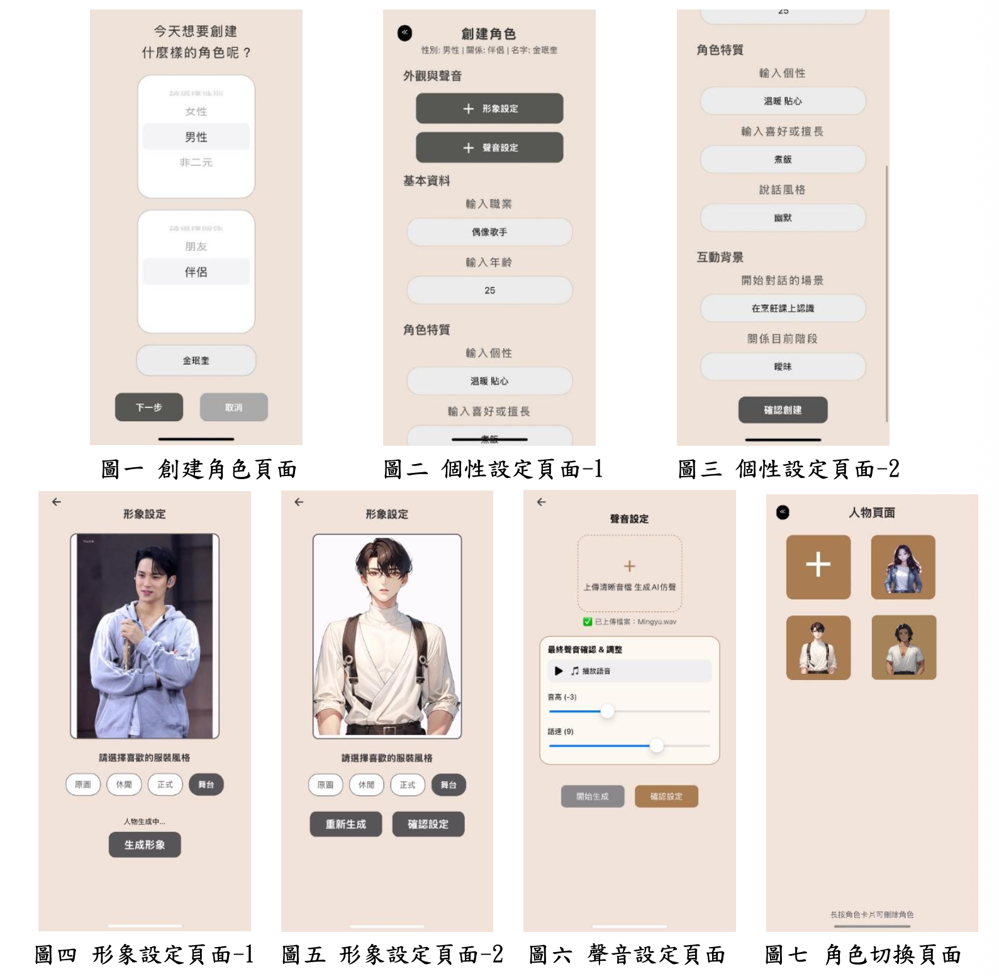
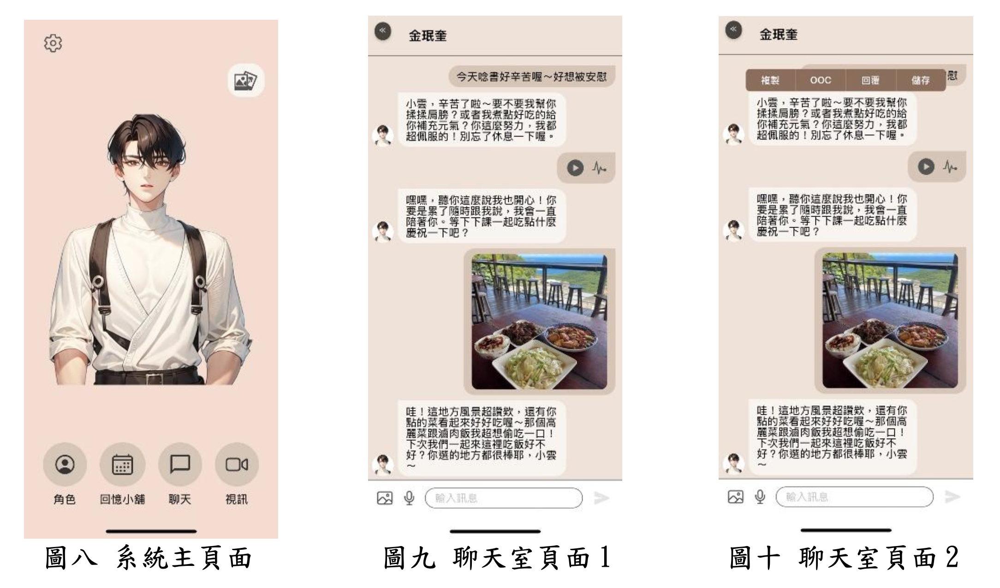
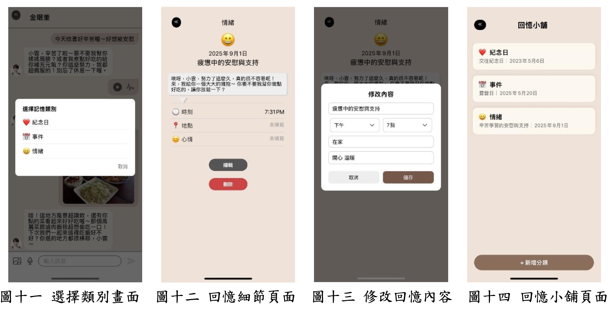
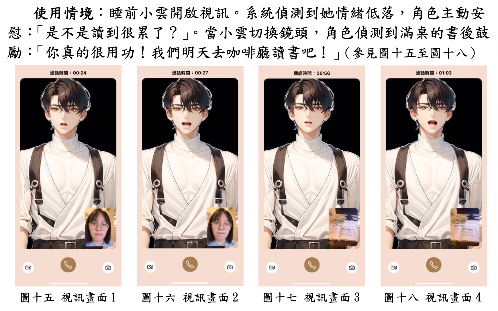
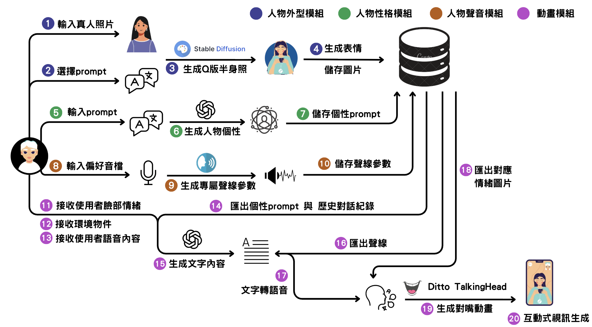
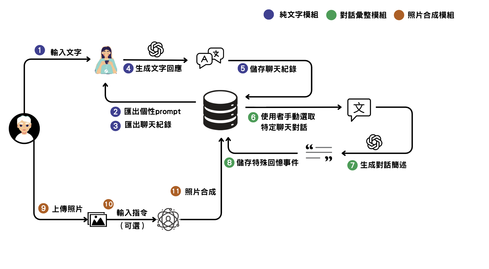
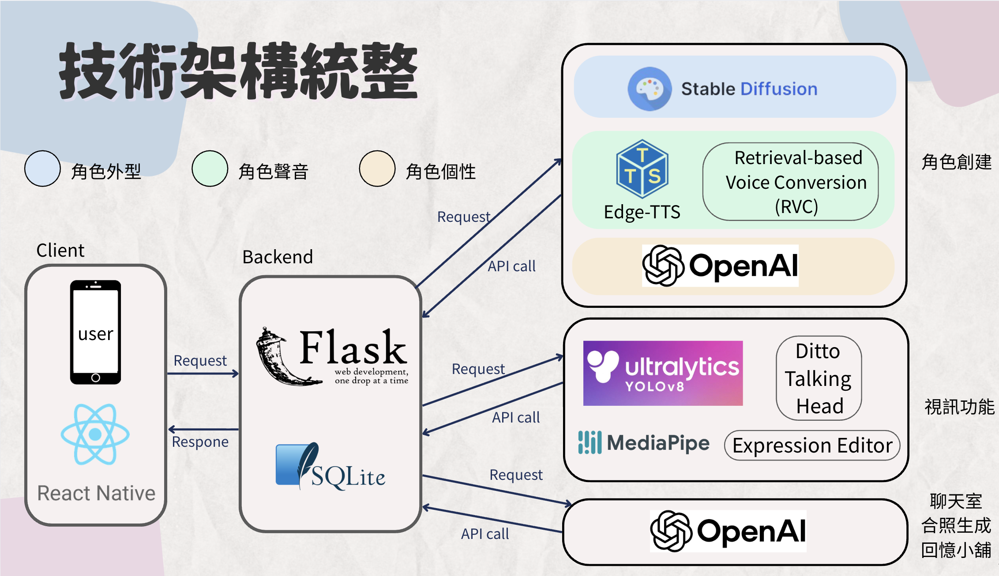

# My AI Companion

[English Version](README.en.md)

一個 AI 虛擬陪伴行動應用程式。使用者可以建立專屬 AI 角色，透過文字、圖片與語音交流，並讓角色逐步延伸出記憶、聲音與動態回應，成為「有形象、有聲音、有記憶」的陪伴型 AI 夥伴。

My AI Companion 結合 React Native 行動端、Flask 後端與多個 AI 服務，將角色設定、對話記憶、外觀生成、語音生成與動態回應整合成一個完整的互動體驗。

## Demo Video

## 專題簡介

My AI Companion 的核心概念是：讓 AI 角色具備更真實的陪伴感。

系統不是只做文字聊天，而是把「角色建立 → 互動 → 記憶累積 → 多模態回應」串成一個完整流程：

- 建立角色背景、關係設定、個性特質與說話風格
- 依照使用者上傳圖片與角色設定生成角色外觀
- 訓練角色聲音模型，產生符合角色設定的語音回應
- 透過 LLM 生成符合角色狀態、關係進展與聊天脈絡的回覆
- 從對話中整理重要事件，形成可查詢與延伸的回憶記錄
- 結合表情、語音與影片回應，讓角色互動從文字延伸到更具沉浸感的體驗

## 特色功能

### 角色創建與多角色切換

使用者可以從關係、性別、名字開始建立角色，再逐步設定角色背景、個性、喜好、說話風格與互動場景。系統也支援上傳參考圖生成角色外觀、設定角色聲音，並在角色列表中自由切換不同陪伴對象。

### 聊天室與回憶小舖

聊天室支援文字、語音與圖片輸入。角色會根據個人設定、關係階段、情緒值、親密度與歷史對話生成回覆，讓對話不只是單次問答，而是能延續關係脈絡的互動。

重要對話可以被整理成回憶，依照類別與時間保存。使用者也能手動收藏喜歡的句子或特別時刻，讓角色逐步累積「共同經歷」。

### 視訊互動與情境感知

視訊模式結合環境辨識、情緒感知與角色動畫。系統可根據鏡頭中的物品、使用者情緒與目前角色狀態，生成更貼近情境的回應，並透過表情與嘴型動畫呈現角色反應。

## 系統架構

## 技術架構

| Layer | Technology | Purpose |
| --- | --- | --- |
| Frontend | JavaScript, React Native, Expo | Mobile app UI |
| Backend | Python, Flask | API orchestration |
| Database | SQLite | User, character, memory data |
| LLM | OpenAI API | Chat, memory, image understanding |
| Speech | Whisper, Edge-TTS, RVC | STT and character voice |
| Image | Stable Diffusion, ControlNet | Character image generation |
| Vision | YOLOv8, MediaPipe Face Mesh | Object and emotion detection |
| Animation | Expression Editor, Ditto TalkingHead | Emotion image and lip-sync video |

## 我的貢獻

- 評估並整合 Stable Diffusion、ControlNet、IP-Adapter 等多項開源模型，建立人物形象生成流程，提升角色外觀一致性。

- 建立角色語音生成流程，整合 TTS 與 RVC，並透過 Google Colab 部署優化 GPU 推論效能。

- 評估並比較 Applio、Hugging Face、Colab、ngrok 等多種 AI 模型與部署方案，選擇適合即時互動的技術流程。

- 串接人物生成模組與視訊互動模組之前後端 API，完成跨模組整合與資料流串接。

- 進行系統整合測試，解決多項 AI 框架與開源專案的環境相依及套件衝突問題，提升系統穩定性。

## 技術挑戰

- 評估多種開源 AI 模型與工具，最終建立適合專案需求的人物生成流程。

- 將 GPU 推論流程由本地環境移轉至 Google Colab，提高開發效率與推論速度。

- 解決多個 AI 框架與開源專案之間的套件相依及環境衝突。

- 設計人物生成、語音生成與視訊互動的完整 AI 工作流程。

## 補充資料

- [系統概述文件](https://drive.google.com/file/d/1U6wqxty2A6w3iSNvNkuHpy3ek5QhO83s/view?usp=sharing)
- [競賽簡報](https://canva.link/6rkvmcfpcpfmia0)
